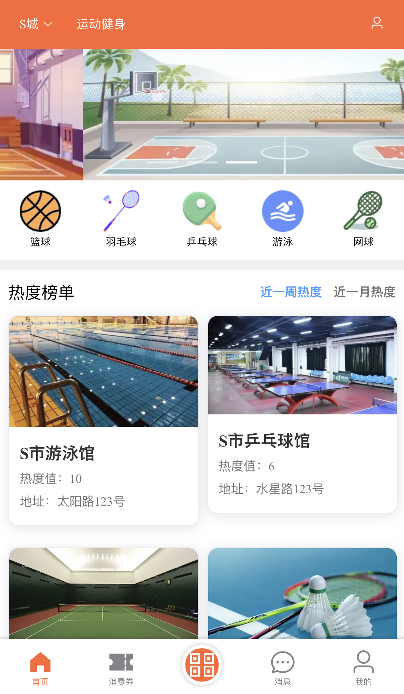
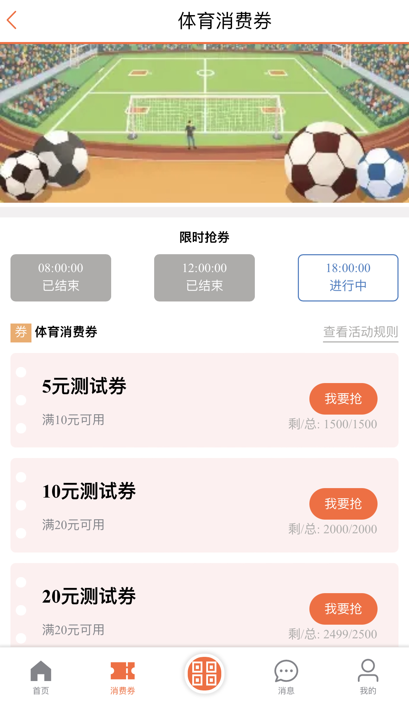
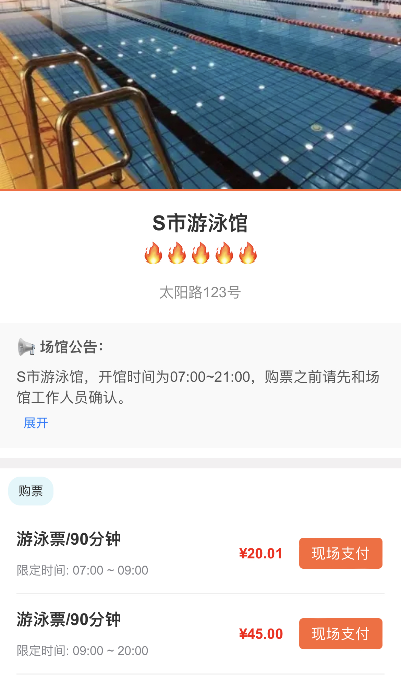
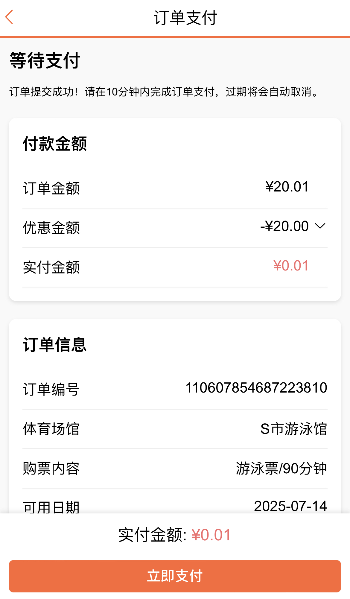
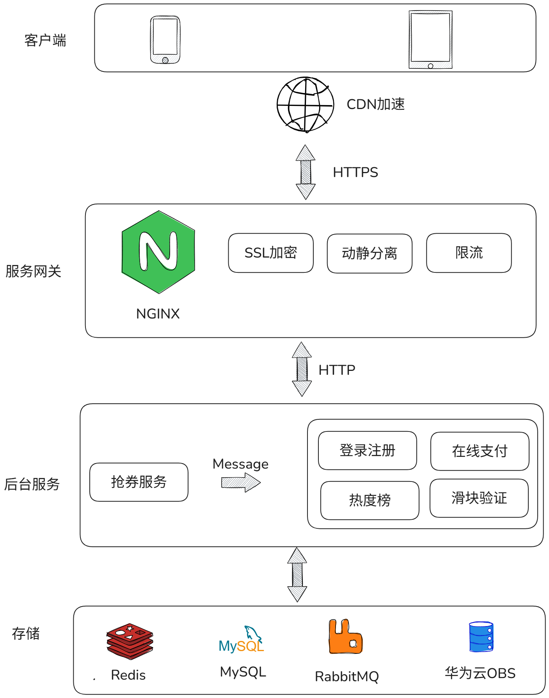
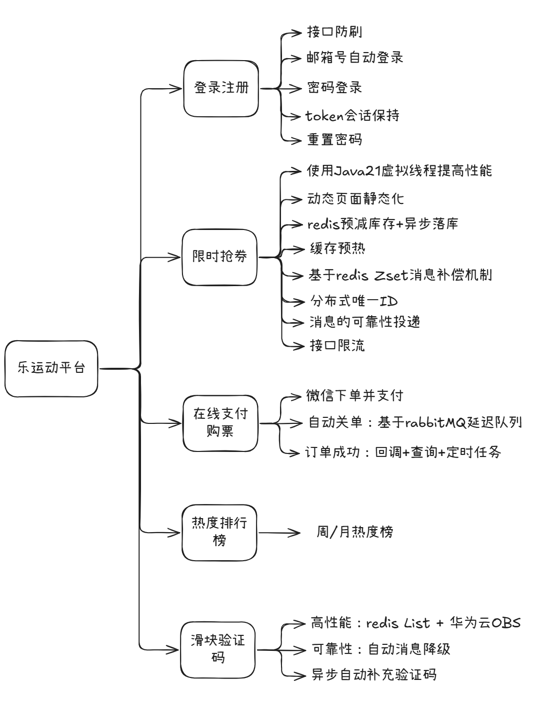
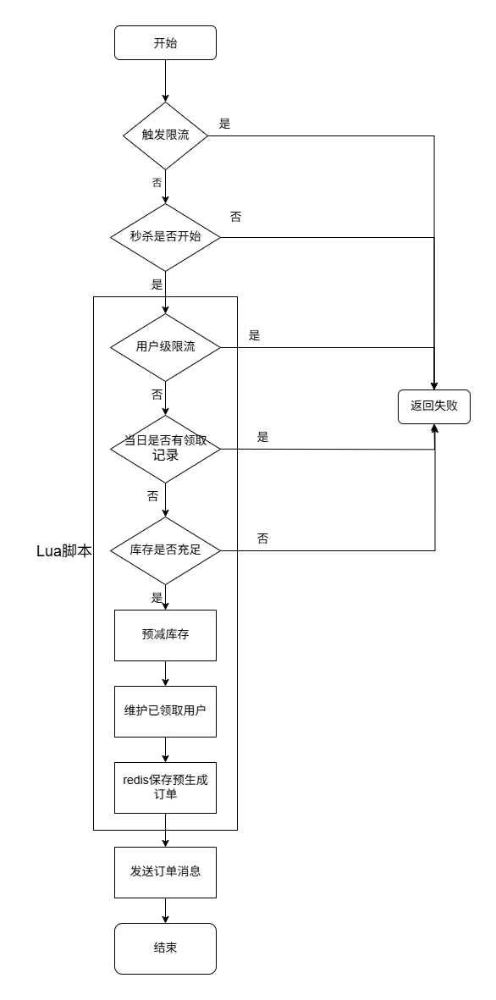
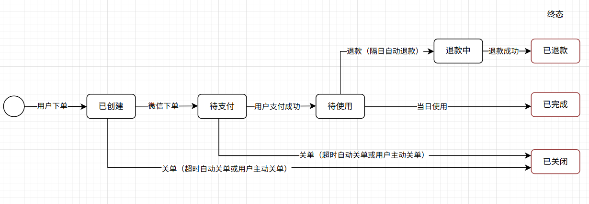
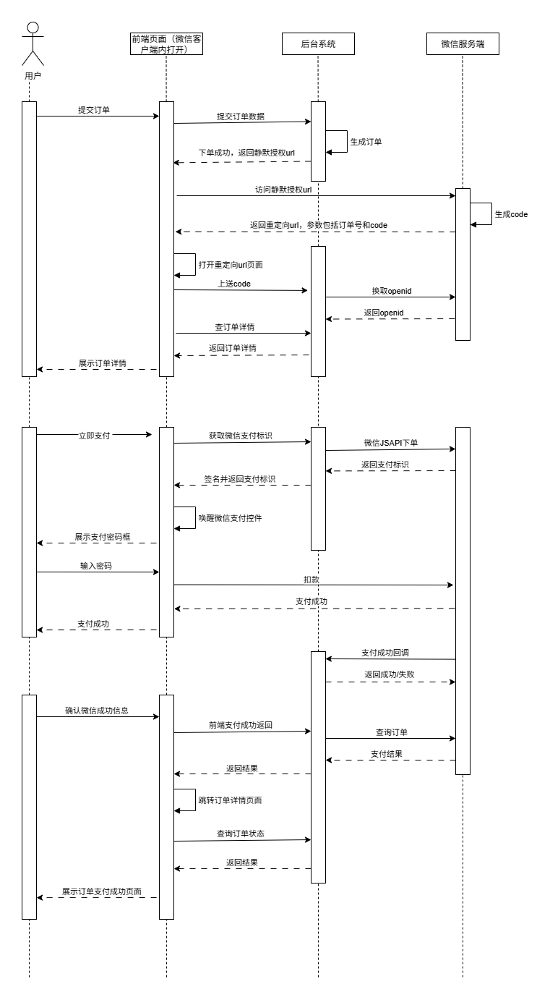

# le-sport

## 项目介绍
le-sport （爱运动）是一个前后端分离的**体育消费券免费发放及在线购票**项目，用户可以在页面内免费抢消费券，并在线购买体育馆的入场票，在购票过程中可以使用优惠券进行优惠，并使用微信支付进行支付。代码目前暂未上传，后续作者整理好之后会将本项目开源。

## 在线体验地址（请使用微信扫描下面二维码打开页面）

注：项目使用了CloudflareCDN，因为Cloudflare没有国内的节点，所以网站加载速度会有点慢，请耐心等待；在打开页面的时候，微信可能会提示“无法确认该页面的安全性，请谨慎访问”属正常现象，点击继续访问即可。

**测试邮箱号**：123456@le.com **密码**：123456le

## 项目预览
<table>
  <tr>
    <td></td>
    <td></td>
    <td></td>
  </tr>
  <tr>
    <td></td>
    <td></td>
    <td></td>
  </tr>
</table>

## 技术栈
- 后端：SpringBoot3 + Java21（开启虚拟线程） + Mybatis + MySQL + Redis + RabbitMQ + Nginx + Docker
- 前端：Vue + ElementUI + Axios
- 部署环境：华为云2核4G服务器 + 华为云OBS + CloudflareCDN

## 项目架构图

## 功能思维导图

## 重点功能模块介绍
### 限时抢券模块
抢券接口采用Redis lua脚本预减库存+RabbitMQ异步发送订单实现，整理逻辑如下

### 在线购票模块
- 订单状态流转图

- 下单支付完整时序图

