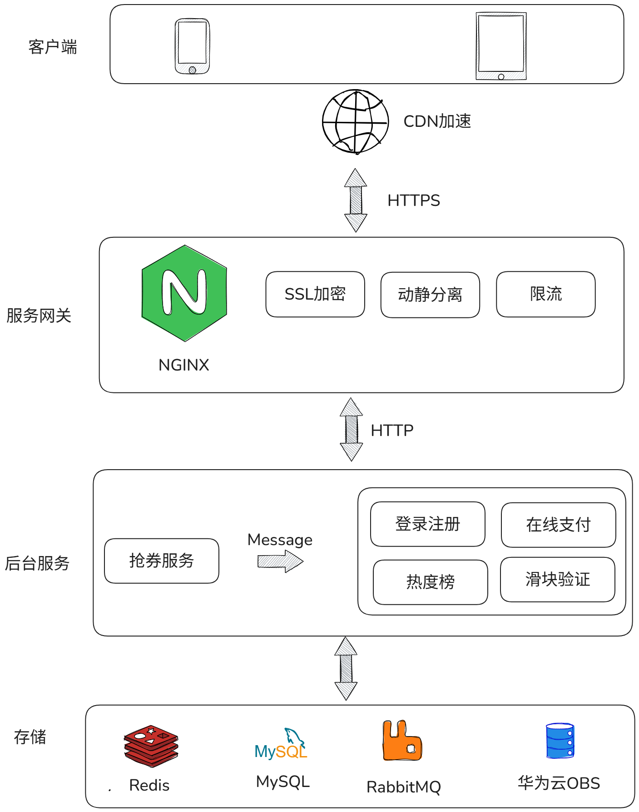
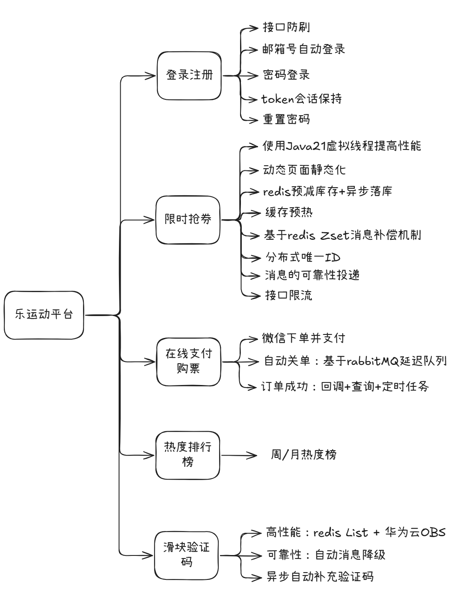
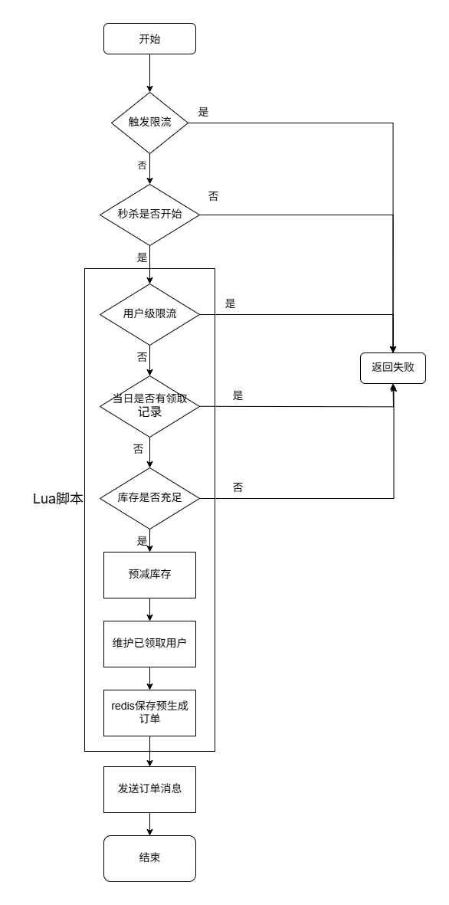
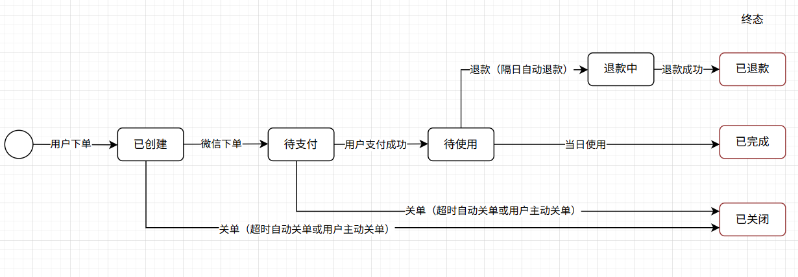
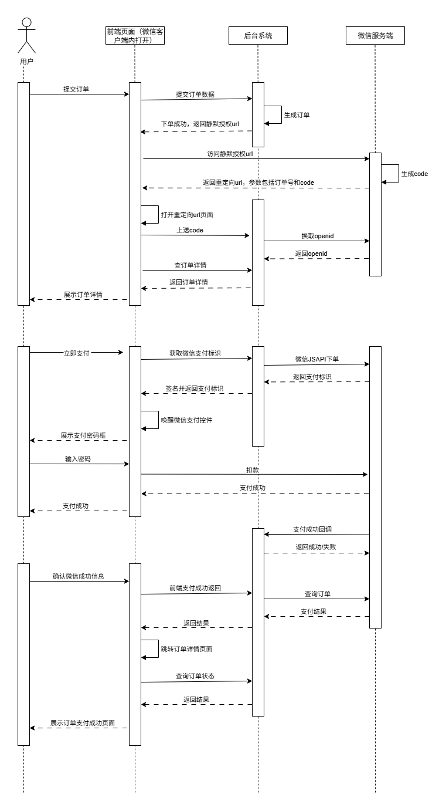

# le-sport

## 项目介绍
le-sport （爱运动）是一个前后端分离的**体育消费券免费发放及在线购票**项目，用户可以在页面内免费抢消费券，并在线购买体育馆的入场票，在购票过程中可以使用优惠券进行优惠，并使用微信支付进行支付。代码目前暂未上传，后续作者整理好之后会将本项目开源。

## 在线体验地址（请使用微信扫描下面二维码打开页面）

## 技术栈
- 后端：SpringBoot + Mybatis + MySQL + Redis + RabbitMQ + Nginx + Docker
- 前端：Vue + ElementUI + Axios

## 项目架构图

## 功能思维导图

## 重点功能模块介绍
### 限时抢券功能

### 微信支付模块

